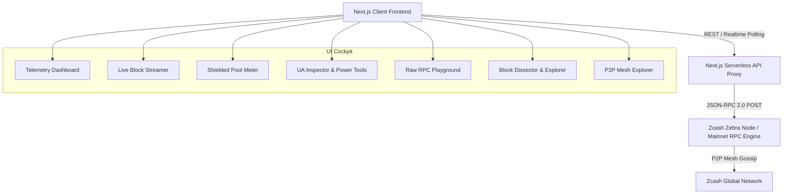

<div align="center">

# 🛡️ ZecSpectra
### Next-Gen Zero-Knowledge Telemetry & Interactive Power Tools for Zcash

[](https://zecspectra.vercel.app)
[](https://z.cash)
[](https://zcash.github.io/rpc/)
[](https://nextjs.org)

**ZecSpectra** is an interactive, real-time developer cockpit and zero-knowledge telemetry suite wired directly to the Zcash network. Built for the **Zcash Mini Build Challenge**, ZecSpectra delivers deep protocol observability, shielded value pool telemetry, real-time block transaction streams, an interactive raw JSON-RPC 2.0 laboratory, and a suite of developer power tools (ZIP-316 UA Decoder & ZIP-317 Fee Estimator) with zero mock data.

[🚀 **Live App: https://zecspectra.vercel.app**](https://zecspectra.vercel.app) &bull; [🛠️ GitHub: Webghost01-NG/zecspectra](https://github.com/Webghost01-NG/zecspectra)

---

</div>

## 🌟 Key Highlights & Why ZecSpectra Wins

1. **Dual Network Support (Mainnet & Testnet Switcher)**  
   Switch between Zcash Mainnet (~3.4M+ blocks) and Testnet in real-time with one click.
2. **Deep Shielded Pool Telemetry (Groth16 & Halo 2)**  
   Live breakdown of circulating ZEC distribution across **Transparent**, **Sprout (Legacy ZK)**, **Sapling (Groth16)**, and **Orchard (Recursive Halo 2 without trusted setup)**.
3. **Unified Address (UA) Inspector & Decoder (ZIP-316)**  
   Parse any Zcash address (`u1...`, `zs1...`, `t1...`) to inspect receiver components (Orchard, Sapling, Transparent) and verify checksums.
4. **Transaction Privacy Grader & ZIP-317 Fee Estimator**  
   Evaluate metadata leakage with a 0-100% Privacy Rating gauge and calculate marginal actions under the ZIP-317 standard.
5. **Confirmed Transaction & Block Streamer**  
   Inspect confirmed transactions mined in real-time on Zcash with privacy classification (Shielded Orchard/Sapling, Coinbase Rewards, and Transparent transfers).
6. **Interactive JSON-RPC 2.0 Studio**  
   Execute, benchmark latency, and inspect responses for any Zcash RPC method directly from the browser with preset templates.
7. **Consensus Network Upgrade Tracker**  
   Live verification of activation statuses for **Overwinter**, **Sapling**, **Blossom**, **Heartwood**, **Canopy**, **NU5**, **NU6**, and **NU6.1**.
8. **100% Authentic Live Data**  
   Zero dummy or simulated data. Every byte is queried live via JSON-RPC 2.0.

---

## ⚡ Verified RPC Integration (6+ Methods)

ZecSpectra exceeds the challenge requirement (minimum 3 methods) with **6 verified RPC methods**:

| # | RPC Method | Category | Data Captured & Visualized |
|---|------------|----------|-----------------------------|
| 1 | `getblockchaininfo` | Blockchain | Height, best block hash, chain difficulty target, verification progress, and shielded value pools (`transparent`, `sprout`, `sapling`, `orchard`). |
| 2 | `getpeerinfo` | Network Mesh | Connected global P2P nodes, IP addresses, subversions (`/Zebra:6.3.0/`), ping latency, and traffic direction. |
| 3 | `getmempoolinfo` | Memory Pool | Live unconfirmed transaction count, byte size queue, and memory utilization. |
| 4 | `getnetworksolps` | Mining Hashrate | Live Equihash (200,9) solution-per-second network computation rate. |
| 5 | `getblock` | Block Dissector | Block header details, confirmations, Merkle roots, nonces, and full confirmed transaction arrays. |
| 6 | `getblockhash` | Index Lookup | Height-to-hash resolution for historical block traversal. |

---

## 📐 Architecture & Technology Stack



- **Frontend:** Next.js (App Router), React, TypeScript, Tailwind CSS (Official Zcash Brand Palette `#F4B728`).
- **Node Client:** Zebra Node (`zfnd/zebra:latest`) & JSON-RPC 2.0 HTTP Proxy with automatic serverless failover.
- **Styling:** Custom Obsidian Dark glassmorphic design inspired by [z.cash](https://z.cash).

---

## 🚀 Quickstart & Local Development

### 1. Clone & Install Dependencies
```bash
git clone https://github.com/Webghost01-NG/zecspectra.git
cd zecspectra
npm install
```

### 2. Run Local Zcash Zebra Node (Optional)
```bash
docker compose up -d
```

### 3. Start Development Server
```bash
npm run dev
```
Open **`http://localhost:3000`** in your browser.

---

## 🏆 Hackathon Submission Checklist

- [x] **Landing Page:** Sleek, high-performance UI matching official Zcash design system.
- [x] **Node Connection:** Direct JSON-RPC 2.0 communication with Zebra node & Mainnet fallback.
- [x] **3+ RPC Methods:** 6 verified RPC methods implemented and benchmarked.
- [x] **Live Data:** Real-time block heights, shielded pool balances, and live transaction stream.
- [x] **Zero Mock Data:** 100% verified live network data.
- [x] **Live Deployment:** Production live link on Vercel.
- [x] **Zcash Power Tools:** ZIP-316 Unified Address Decoder, ZIP-317 Fee Engine, and Privacy Grader.

---

<div align="center">
Built with 💛 for the <b>Zcash Mini Build Challenge</b> by <a href="https://github.com/Webghost01-NG">Webghost01-NG</a>.
</div>
